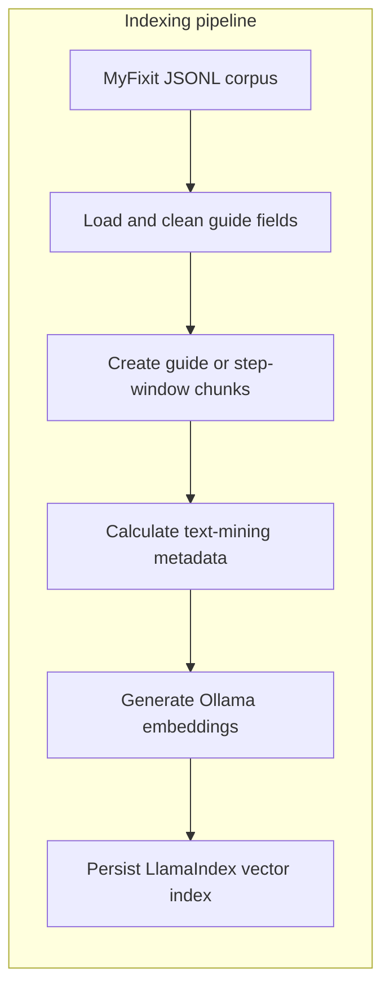
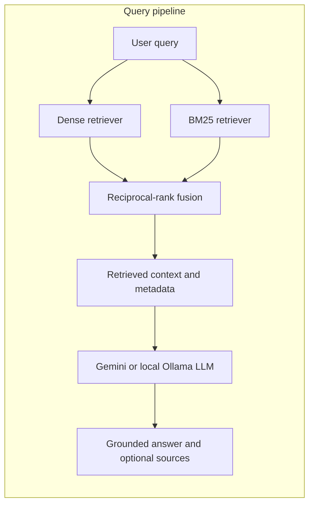

# RAG-Based Repair Manual Assistant

**Course:** MINTRI  
**Authors:** Milan Marcinco (1252431), Agata Szysiak (1252365)  
**Date:** 2026-06-14

# Table of Contents

1. [Introduction and Problem Definition](#1-introduction-and-problem-definition)
2. [System Overview](#2-system-overview)
   - 2.1. [Indexing Pipeline](#indexing-pipeline)
   - 2.2. [Query Pipeline](#query-pipeline)
3. [Corpus and Data Preparation](#3-corpus-and-data-preparation)
4. [Retrieval Component](#4-retrieval-component)
5. [Generation Component](#5-generation-component)
6. [Text Mining Features](#6-text-mining-features)
7. [Evaluation and Validation](#7-evaluation-and-validation)
8. [Results and Discussion](#8-results-and-discussion)
9. [Future Improvements](#9-future-improvements)
10. [Conclusion](#10-conclusion)

## 1. Introduction and Problem Definition

Repair manuals contain precise device-specific procedures, but finding the relevant step in a large collection is slow. General-purpose language models may also invent tools, measurements, or instructions when answering repair questions.

This project implements a Retrieval-Augmented Generation (RAG) assistant for technical repair manuals. A user asks a question in natural language, the system retrieves relevant manual content, and a language model produces an answer grounded in that content. The intended users are device owners, students, hobbyists, and novice repair technicians who need concise instructions or a specific fact from a guide.

The engineering goal is to combine lexical and semantic retrieval with grounded generation, while exposing source evidence and a basic estimate of repair complexity and risk.

## 2. System Overview

The implementation uses LlamaIndex for indexing, retrieval, and query execution. Hybrid retrieval was selected because repair questions contain both exact terms, such as device models, part names and screw sizes, and paraphrased descriptions that benefit from semantic matching. The system provides one-shot and interactive command-line modes, plus a retriever-only mode for inspecting search results without calling an LLM.

### 2.1. Indexing Pipeline



### 2.2. Query Pipeline



## 3. Corpus and Data Preparation

The local corpus is derived from the [MyFixit dataset](https://github.com/rub-ksv/MyFixit-Dataset). It is stored as a JSON Lines file in which each record represents one repair guide.

| Measurement             | Full local file | Default indexed subset |
| ----------------------- | --------------: | ---------------------: |
| Guides                  |           3,682 |                    100 |
| Steps                   |          41,983 |                  1,264 |
| Categories              |             746 |                     24 |
| Average steps per guide |           11.40 |                  12.64 |
| Average tools per guide |            3.70 |                   3.20 |

The loader uses the guide ID, title, category, toolbox, step order, and raw step text. Step text is trimmed and prefixed with its one-based order. Images, URLs, ancestor categories, and extracted per-step tool annotations are not indexed.

By default, all steps from one guide form one document chunk. The `--steps-per-chunk` option can create smaller consecutive step windows, and `--steps-overlap` can preserve context between adjacent windows. Whole-guide chunks retain procedural context but may reduce retrieval precision for long guides. Smaller windows improve precision but can omit prerequisites or earlier safety instructions.

The index is persisted locally and can be rebuilt with `--rebuild-index`. The implementation expects `dataset/dataset.json`.

## 4. Retrieval Component

The system uses hybrid retrieval:

- **Dense retrieval:** `nomic-embed-text` through Ollama, stored in the default persisted LlamaIndex vector store.
- **Lexical retrieval:** BM25 over the indexed chunks.
- **Fusion:** reciprocal-rank fusion with weights `0.6` for dense retrieval and `0.4` for BM25.
- **Retrieval depth:** three chunks by default, configurable with `--top-k`.

Dense retrieval handles paraphrases, while BM25 favors exact device names, component names, measurements, and tool terms. The fusion reduces dependence on either method alone.

Current limitations include the absence of reranking, metadata filters and query expansion.

## 5. Generation Component

The generator is selected from environment configuration:

- Gemini is used when `GEMINI_API_KEY` is set. The default model is `gemini-2.5-flash`.
- Otherwise, a local Ollama model is used. The default is `qwen3.5:4b`.
- Retriever-only mode uses no generation model.

Retrieved chunks are inserted into a custom repair prompt. The prompt instructs the model to use only the supplied evidence, avoid inventing details, report insufficient context, keep device-specific procedures separate, remove unusable image references etc. Questions asking for a single fact receive a short response, while procedural questions may receive tools, safety checks, and numbered steps.

These instructions reduce hallucination but do not guarantee factual correctness. Sources can be printed after the answer with `--print-sources`, but the generated answer does not contain formal inline citations.

## 6. Text Mining Features

The implemented text-mining layer performs rule-based analysis when the corpus is loaded. It joins all step text from a guide, converts it to lowercase, and produces metadata that is stored with every chunk created from that guide:

- Counts steps and listed tools.
- Detects unique occurrences of predefined risk indicators such as `battery`, `heat`, `fragile`, `connector`, and `glass`.
- Counts every occurrence of common repair actions such as `remove`, `disconnect`, `pry`, and `lift`.
- Classifies guide complexity as low, medium, or high.

The raw complexity value is:

```text
number of steps +
    2 * number of tools +
    3 * number of detected risk terms +
    number of detected action occurrences
```

This value is converted to a percentile-like score from 0 to 100 using the full corpus distribution. Scores up to 33 are low, scores up to 66 are medium, and higher scores are high. The analysis is attached to chunk metadata, displayed with source output, and made available to the generation prompt.

For example, a guide with 12 steps, 3 tools, the indicators `battery` and `connector`, and 9 detected action occurrences receives a raw score of `12 + 6 + 6 + 9 = 33`. Its final score and label depend on where 33 ranks among all guide scores. Source output presents the result in a compact form such as `Complexity: medium (score 54/100)`, followed by the step count, tool count, detected risk indicators, and action frequencies.

This is a heuristic complexity classification, not a safety assessment. Detection uses substring matching and a fixed vocabulary, so it can miss synonyms and produce false matches. Future improvements could include more sophisticated keyword extraction, topic modeling, and clustering to identify common repair patterns.

## 7. Evaluation and Validation

...

## 8. Results and Discussion

The prototype provides the main RAG workflow: corpus loading, persistent semantic indexing, hybrid retrieval, optional local or hosted response generation, source inspection, and guide-level complexity analysis. Its command-line flags make chunking, retrieval depth, corpus size, and index rebuilding configurable.

## 9. Future Improvements

...

## 10. Conclusion

The project demonstrates a repair-focused RAG pipeline that combines BM25 and dense retrieval with grounded answer generation. It also adds a transparent heuristic for repair complexity and risk indicators.
