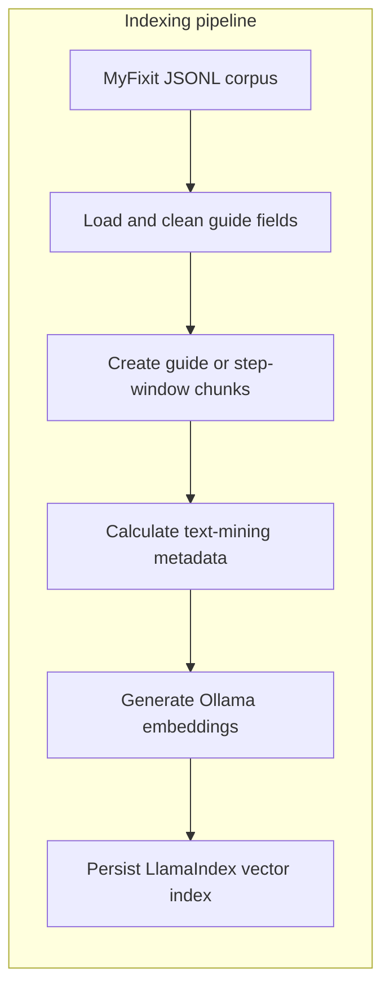
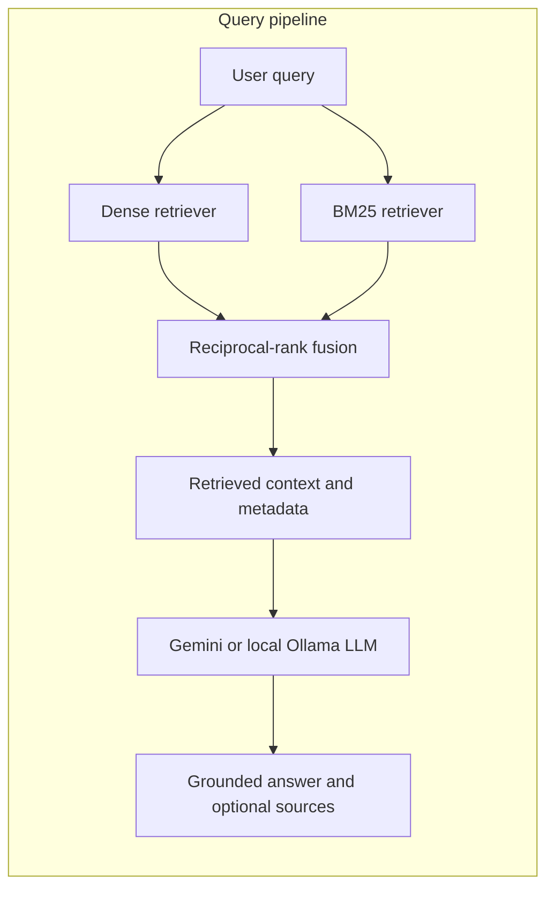

# RAG-Based Repair Manual Assistant

**Course:** MINTRI  
**Authors:** Milan Marcinco (1252431), Agata Szysiak (1252365)  
**Date:** 2026-06-14

# Table of Contents

1. [Introduction and Problem Definition](#1-introduction-and-problem-definition)
2. [System Overview](#2-system-overview)
   - 2.1. [Indexing Pipeline](#21-indexing-pipeline)
   - 2.2. [Query Pipeline](#22-query-pipeline)
3. [Corpus and Data Preparation](#3-corpus-and-data-preparation)
4. [Retrieval Component](#4-retrieval-component)
5. [Generation Component](#5-generation-component)
6. [Text Mining Features](#6-text-mining-features)
7. [Evaluation and Validation](#7-evaluation-and-validation)
   - 7.1. [Worked Query Example](#71-worked-query-example)
   - 7.2. [Success and Failure Analysis](#72-success-and-failure-analysis)
8. [Results and Discussion](#8-results-and-discussion)
9. [Future Improvements](#9-future-improvements)
10. [Conclusion](#10-conclusion)

## 1. Introduction and Problem Definition

Repair manuals contain precise device-specific procedures, but finding the relevant step in a large collection is slow. General-purpose language models may also invent tools, measurements, or instructions when answering repair questions.

This project implements a Retrieval-Augmented Generation (RAG) assistant for technical repair manuals. A user asks a question in natural language, the system retrieves relevant manual content, and a language model produces an answer grounded in that content. The intended users are device owners, students, hobbyists, and novice repair technicians who need concise instructions or a specific fact from a guide.

The engineering goal is to combine lexical and semantic retrieval with grounded generation, while exposing source evidence and a basic estimate of repair complexity and risk.

## 2. System Overview

The implementation uses LlamaIndex for indexing, retrieval, and query execution. The MyFixit corpus was selected because repair guides are procedural, device-specific, and rich in exact facts such as tools, screw sizes, warnings, and component names. These properties make the corpus suitable for testing whether retrieval can locate precise evidence and whether generation can turn that evidence into a concise answer.

Hybrid retrieval was selected because repair questions contain both exact terminology and paraphrased descriptions. BM25 handles literal matches such as model names and measurements, while dense retrieval can match semantically similar wording. The generator is separated from retrieval so the same evidence pipeline can be tested with either a hosted or local LLM. The text-mining layer is calculated during indexing because guide-level statistics do not change between queries and can therefore be reused without repeated processing.

### 2.1. Indexing Pipeline



### 2.2. Query Pipeline



## 3. Corpus and Data Preparation

The local corpus is derived from the [MyFixit dataset](https://github.com/rub-ksv/MyFixit-Dataset). It is stored as a JSON Lines file in which each record represents one repair guide.

| Measurement             | Full local file | Default indexed subset |
| ----------------------- | --------------: | ---------------------: |
| Guides                  |           3,682 |                    100 |
| Steps                   |          41,983 |                  1,264 |
| Categories              |             746 |                     24 |
| Average steps per guide |           11.40 |                  12.64 |
| Average tools per guide |            3.70 |                   3.20 |

The loader uses the guide ID, title, category, toolbox, step order, and raw step text. Blank lines in the JSONL file are skipped, step text is stripped of surrounding whitespace, unnamed tools are excluded, and zero-based step orders are converted to one-based labels. Images, URLs, ancestor categories, and extracted per-step tool annotations are not indexed because the current prototype answers from text and does not process images.

A scan of the local dataset found no missing guide IDs, titles, categories, step text, tool names, or guides without steps.

By default, all steps from one guide form one document chunk. This choice preserves prerequisites, warnings, and chronological dependencies that may be lost when an individual step is retrieved alone. The trade-off is that long guides add irrelevant text to the prompt and can reduce retrieval precision. The `--steps-per-chunk` option supports smaller consecutive step windows, while `--steps-overlap` can preserve limited context between adjacent windows.

## 4. Retrieval Component

The system uses hybrid retrieval:

- **Dense retrieval:** `nomic-embed-text` through Ollama.
- **Lexical retrieval:** BM25 over the indexed chunks.
- **Fusion:** reciprocal-rank fusion with weights `0.6` for dense retrieval and `0.4` for BM25.
- **Retrieval depth:** three chunks by default, configurable with `--top-k`.

`nomic-embed-text` was selected because it runs locally through the same Ollama service used by the optional local generator. This avoids sending corpus content to an external embedding API, removes per-request embedding cost, and makes the indexing setup reproducible. This specific model was chosen for its balance of performance and resource use.

LlamaIndex's default local vector index backed by `SimpleVectorStore` is used as the primary storage mechanism. Underneath it writes to the `PERSIST_DIR` directory.

Dense retrieval handles paraphrases, while BM25 favors exact device names, component names, measurements, and tool terms. Reciprocal-rank fusion combines their rankings without requiring their raw scores to use the same scale. The `0.6/0.4` weighting gives a small preference to semantic retrieval while retaining substantial lexical influence.

Current limitations include the absence of reranking, metadata filters, query expansion.

## 5. Generation Component

The generator is selected from environment configuration:

- Gemini is used when `GEMINI_API_KEY` is set. The default model is `gemini-2.5-flash`.
- Otherwise, a local Ollama model is used. The default is `qwen3.5:4b`.
- Retriever-only mode uses no generation model.

Gemini 2.5 Flash provides a hosted generation option without changing the retrieval pipeline and was selected as the default API model for practical prototype use. Qwen 3.5 4B provides a smaller local alternative for offline use, privacy, and systems with limited resources.

Retrieved chunks are inserted into a custom repair prompt as a single block of formatted text, so is the user query. The prompt instructs the model with multiple rules, such as to use only the supplied evidence, avoid inventing details, report insufficient context, keep device-specific procedures separate, and more. Questions asking for one fact receive a short response, while procedural questions may receive tools, safety checks, and numbered steps.

These instructions reduce hallucination but do not guarantee factual correctness. Sources can be printed after the answer with `--print-sources`, but the generated answer does not contain formal inline citations.

## 6. Text Mining Features

The implemented text-mining layer performs rule-based analysis when the corpus is loaded. It joins all step text from a guide, converts it to lowercase, and produces metadata that is stored with every chunk created from that guide:

- Counts steps and listed tools.
- Detects the presence of predefined risk indicators such as `battery`, `heat`, `fragile`, `connector`, and `glass`; each detected term contributes once.
- Counts every occurrence of common repair actions such as `remove`, `disconnect`, `pry`, and `lift`.
- Classifies guide complexity as low, medium, or high.

The raw complexity value is:

```text
number of steps +
    2 * number of tools +
    3 * number of detected risk terms +
    number of detected action occurrences
```

This value is converted to a percentile-like score from 0 to 100 using the full corpus distribution. Scores up to 33 are low, scores up to 66 are medium, and higher scores are high. The analysis is attached to chunk metadata, displayed with source output, and made available to the generation prompt.

The choice of a rule-based method favors transparency, low processing cost, and reproducibility. Step and tool counts provide basic workload indicators, risk terms identify potentially sensitive operations, and action frequencies approximate procedural effort. The weights give tools twice the contribution of a step and risk indicators three times the contribution because equipment requirements and warnings are treated as stronger complexity signals. These weights are heuristic and were not learned from labelled data.

For guide 574, the implemented analysis produces the following real metadata:

```text
Complexity: high (score 73/100)
Total steps: 13
Total tools: 3
Risk indicators: careful, adhesive, connector, cable, glass
Common actions: remove (7), disconnect (3), pry (1), lift (3), pull (1), peel (1), separate (2), detach (1)
```

This is a heuristic complexity classification, not a safety assessment. Detection uses substring matching and a fixed vocabulary, so it can miss synonyms and produce false matches. Future improvements could include more sophisticated keyword extraction, topic modeling, and clustering to identify common repair patterns.

## 7. Evaluation and Validation

...

## 8. Results and Discussion

The prototype provides the main RAG workflow: corpus loading, persistent semantic indexing, hybrid retrieval, optional local or hosted response generation, source inspection, and guide-level complexity analysis. Its command-line flags make chunking, retrieval depth, corpus size, and index rebuilding configurable.

## 9. Future Improvements

...

## 10. Conclusion

The project demonstrates a repair-focused RAG pipeline that combines BM25 and dense retrieval with grounded answer generation. It also adds a transparent heuristic for repair complexity and risk indicators.
